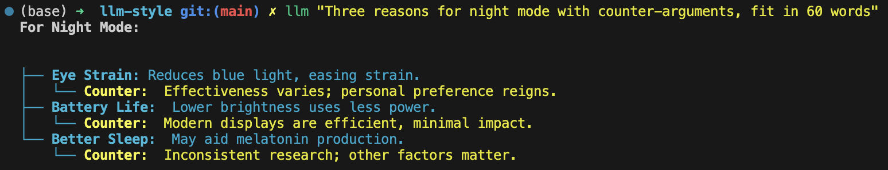
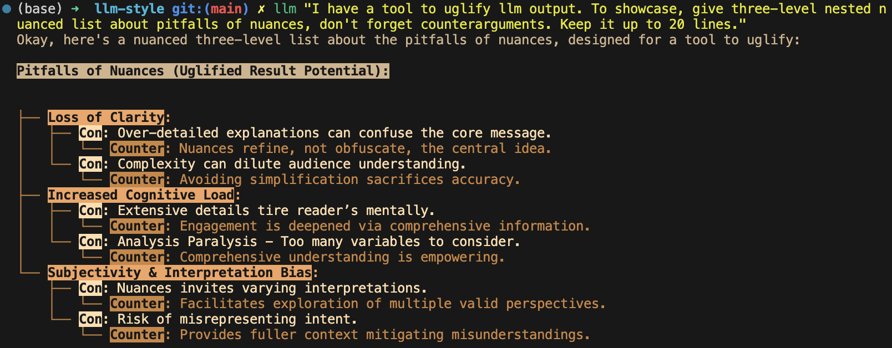

> Colors are perception, child. We decide what they mean.
>
> -- Inspired by themes in Brandon Sanderson's *Warbreaker*

# llm-style: Rich Terminal Styling for LLM Output

**Version: 0.6.0**

Rich terminal styling for Markdown-like LLM output using panels, trees, inline styles, dynamic color transformations, and configurable regex rules.

<figure>

<figcaption><em>(Above: Example using the ``tan-crazybold-style.json`` theme. The "crazy" reverse video for bold is intentional for high contrast.)</em></figcaption>
</figure>

<figure>

<figcaption><em>(Above: Example showing nested lists rendered as trees and styled headers using the default green theme.)</em></figcaption>
</figure>

## Motivation

Raw text output from LLMs can be hard to read, especially when it contains structural elements like headers, lists, or code blocks but isn't always perfectly valid Markdown. Standard Markdown renderers might fail or produce suboptimal results on this "Markdown-like" text.

`llm-style` aims to bridge this gap by using a combination of configurable regular expressions and a state machine to detect common structural elements and apply rich formatting (colors, bold, italic, panels, tree guides) using the excellent `rich` Python library, making the output significantly more readable directly in the terminal.

## Key Features

- **Markdown-like Aware:** Designed to handle common structures found in LLM output, even if not strictly valid Markdown.
- **Highly Configurable:** Uses simple JSON files for:
  - \`detection.json\`: Define regex patterns to identify structures.
  - \`mapping.json\`: Map detected structures to style names or block configurations.
  - <span class="title-ref">\<style-file\>.json</span> (e.g., <span class="title-ref">styles.json</span>, <span class="title-ref">green-theme.json</span>): Define named styles using <span class="title-ref">rich</span>'s powerful syntax, including dynamic transformations.
- **Rich Output:** Leverages the `rich` library for:
  - Colors (Truecolor, 256, basic).
  - Styles (bold, italic, underline, dim, reverse, etc.).
  - **Panels:** Draws borders around code blocks and blockquotes.
  - **Trees:** Draws guide lines for nested lists.
  - Syntax highlighting for code blocks (requires `pygments`).
- **Dynamic Inline Styles:** Configure inline styles (like bold) to dynamically adjust color (brightness, saturation, hue) based on the surrounding text's color.
- **Style Themes:** Load different style definitions using the `--style` argument. The default is <span class="title-ref">styles.json</span>.
- **Flexible Detection:** Uses regex for primary structure detection, allowing custom rules beyond standard Markdown.
- **Pipeline Friendly:** Designed to be used in standard Unix pipelines (e.g., `llm ... | llm-style.py`).
- **Shell Integration:** Optional shell function (Zsh example provided) to automatically pipe <span class="title-ref">llm</span> output.
- **Debug Mode:** Includes a `--debug` flag for verbose configuration loading/validation and transformation output.
- **Markup Preservation:** Optional `--keep-markup` flag to display original block markup characters (<span class="title-ref">\#</span>, <span class="title-ref">\*</span>, <span class="title-ref">\*\*</span>).

## Installation

1.  **Prerequisites:**

    - Python 3.7+ (Python 3.8+ recommended for built-in <span class="title-ref">colorsys</span>)
    - <span class="title-ref">pip</span> (Python package installer)

2.  **Required Libraries:**

    - \`rich\`: The core rendering library. (Version 13+ recommended).
    - <span class="title-ref">pygments</span> (Optional, but Recommended): For syntax highlighting within code blocks.
    - <span class="title-ref">colorsys</span> (Usually built-in with Python): Required for dynamic color transformations. If missing, transforms will be skipped.

    Install them using pip:

    ``` bash
    pip install "rich>=13.0" pygments
    ```

3.  **Get the Script:**

    - Clone this repository or download the <span class="title-ref">llm-style.py</span> script directly.

      ``` bash
      # Example if cloning
      git clone https://github.com/gagin/llm-style.git
      cd llm-style
      ```

4.  **Make Executable (Optional):**

    ``` bash
    chmod +x llm-style.py
    ```

## Usage

`llm-style` reads text from standard input and prints styled output to standard output. It's designed to be used in a pipeline.

**Basic Usage (Default Style):**

Pipe the output of the `llm` command (or any text-producing command) into the script. This uses <span class="title-ref">styles.json</span> in your config directory (by default <span class="title-ref">~/.config/llm-style/</span>), creating it with a default green theme if it doesn't exist.

``` bash
llm "Explain Python decorators" | python llm-style.py
# Or if executable:
# llm "Explain Python decorators" | ./llm-style.py
```

**Using a Specific Style Theme:**

Use the `--style` argument to specify a different JSON file located within your config directory.

``` bash
# Assuming you have ~/.config/llm-style/tan-crazybold-style.json
llm "Pros and cons" | python llm-style.py --style tan-crazybold-style.json
```

**Using a Local Style File (without copying):**

You can use a style file by providing a relative or absolute path. If the path exists, it will be loaded directly. You can also use `--config-dir .` to make the script look for <span class="title-ref">detection.json</span> and <span class="title-ref">mapping.json</span> in the current directory.

``` bash
# Attempts to load style directly by path (relative or absolute)
llm "Use path style" | python llm-style.py --style ./path/to/my-style.json

# Use style from current dir, look for other configs in current dir too
# Allows detection.json/mapping.json to be created in '.' if missing
llm "Use local style" | python llm-style.py --config-dir . --style my-local-style.json
```

**Using Shell Integration (Recommended for Convenience):**

If you've added the provided Zsh function (see "Shell Integration" section) to your `.zshrc`, you can just use the `llm` command directly, and it will automatically be styled using your configured preference:

``` bash
# Assumes the 'llm' function is defined in .zshrc to pipe through the styler
llm "This output will be automatically styled"
```

**Keeping Block Markup:**

``` bash
llm "Show raw markdown" | python llm-style.py --keep-markup
```

**Debugging Configuration:**

Redirect standard output to <span class="title-ref">/dev/null</span> and error/debug output to a file to isolate debug messages.

``` bash
llm "Debug this" | python llm-style.py --debug --style my-debug-style.json > /dev/null 2> debug.log
```

*(Note: Replace \`\`python llm-style.py\`\` with \`\`./llm-style.py\`\` if executable and in the correct path/directory).*

## `--help` Output

``` text
usage: llm-style.py [-h] [--config-dir CONFIG_DIR] [--style STYLE] [--debug] [--keep-markup]

Apply styles to text input based on configurable rules.

options:
  -h, --help            show this help message and exit
  --config-dir CONFIG_DIR
                        Directory containing detection.json, mapping.json, and style JSON files. (default: ~/.config/llm-style)
  --style STYLE         Filename or path of the style definitions JSON file. If not absolute/relative, assumed within config directory. (default: styles.json)
  --debug               Enable debug/verbose output to stderr. (default: False)
  --keep-markup         Keep original Markdown block characters (e.g., '#', '*', '>') in the output. (default: False)
```

## Showcase Script (<span class="title-ref">showcase-brief.sh</span>)

A helper script <span class="title-ref">showcase-brief.sh</span> is available in the repository to quickly compare multiple <span class="title-ref">\*style.json</span> or <span class="title-ref">\*styles.json</span> files located in the current directory. Edit the script to set the correct path to <span class="title-ref">llm-style.py</span>, make it executable (<span class="title-ref">chmod +x showcase-brief.sh</span>), and run it (<span class="title-ref">./showcase-brief.sh</span>) in a directory containing your style JSON files. It will first run with the default style, then iterate through local style files found, displaying a short sample for each.

## Comparison with Other Tools

Tools like [glow](https://github.com/charmbracelet/glow), [mdcat](https://github.com/swsnr/mdcat), and [bat](https://github.com/sharkdp/bat) are excellent terminal Markdown renderers/viewers. Why use `llm-style`?

- **Strictness:** Tools like <span class="title-ref">glow</span> or <span class="title-ref">mdcat</span> often expect reasonably valid CommonMark or GitHub Flavored Markdown. They might produce errors or poor formatting if the LLM output deviates significantly (e.g., inconsistent indentation, malformed lists, unusual syntax). `llm-style` uses regex and is designed to be more forgiving of "Markdown-like" text.
- **Flexibility vs. Robustness:** Standard Markdown renderers have robust parsers for *Markdown*, handling complex nesting and edge cases correctly, including inline formatting. `llm-style`'s regex-based approach (especially for inline elements) is less robust for pure Markdown but offers the flexibility to style arbitrary, non-Markdown patterns defined in `detection.json`.
- **Unique Rendering:** `llm-style` leverages `rich` features not typically found in standard Markdown viewers, specifically drawing bordered **Panels** around code blocks/blockquotes and rendering nested lists with guiding **Tree** lines.
- **Configuration:** `llm-style` offers direct JSON configuration for detection patterns, style mapping, and <span class="title-ref">rich</span> styles, including dynamic color transformations for inline elements. Other tools rely on their specific theme formats.

**Choose \`\`llm-style\`\` if:**

- Your input is often "Markdown-like" but not strictly valid.
- You want the specific visual structure provided by Panels and Trees.
- You need to style custom text patterns beyond standard Markdown using regex.
- You want dynamic inline styling based on context.
- You prefer direct JSON configuration tied to `rich` and want theme support.

**Choose standard tools (\`\`glow\`\`, \`\`bat\`\`, \`\`mdcat\`\`) if:**

- Your input is reliably well-formed Markdown.
- Robust handling of all Markdown features (especially complex inline/nested elements) is the top priority.
- You prefer using existing theme ecosystems (e.g., for `bat`).

## Configuration

On the first run, if the configuration directory (default: `~/.config/llm-style/`) or the default config files don't exist, `llm-style` will create them with default settings (based on a greenish theme).

- **\`detection.json\`:** Maps rule names to Python regex patterns for structure detection.
- **\`mapping.json\`:** Connects rule names from <span class="title-ref">detection.json</span> to style names or special block configurations (like panels). Requires `"default_text"`.
- **\`\<style-file\>.json\`** (e.g., <span class="title-ref">styles.json</span>, specified via `--style`): Maps style names (referenced in <span class="title-ref">mapping.json</span>) to `rich` style definitions. This is where colors, attributes, and dynamic transformations are defined.

**Recommendation:** Copy the default <span class="title-ref">styles.json</span> generated by the script or provided theme examples (like <span class="title-ref">tan-crazybold-style.json</span>, <span class="title-ref">panel-showcase-style.json</span>) from the source repository into your <span class="title-ref">~/.config/llm-style/</span> directory. Use these as starting points for your own customization by editing the JSON files.

## Color Guide (Using <span class="title-ref">rich</span> Styles)

The styles defined in your style JSON file use the syntax understood by the [rich](https://github.com/Textualize/rich) library.

**How to Specify Colors:**

1.  **Standard Color Names:** Use common names like `"red"`, `"green"`, `"blue"`, `"yellow"`. Hex codes are generally more reliable than less common names.
2.  **Hex Codes (Truecolor):** Recommended for specific colors if your terminal supports Truecolor. Example: `"#FFA500"`, `"#A0522D"`.
3.  **RGB Tuples (Truecolor):** Specify RGB values from 0-255. Example: `"rgb(255,165,0)"`.
4.  **Numbered Colors (256-Color Terminals):** Use numbers 0-255. Example: `"color(178)"`.

**Combining with Attributes:**

Combine colors with attributes like `bold`, `italic`, `underline`, `dim`, `strike`, `reverse`, and background colors using `on <color>`.

*Example:* `"style_error": "bold white on red"` *Example:* `"style_inline_bold": "bold reverse"`

Refer to the [rich Style documentation](https://rich.readthedocs.io/en/latest/style.html) for comprehensive details.

Inline Style Customization & Transformations ------------------------------------------

Inline styles (<span class="title-ref">bold</span>, <span class="title-ref">italic</span>, <span class="title-ref">code</span>) are handled via rules like <span class="title-ref">inline_bold_star</span>, <span class="title-ref">inline_code</span>, etc., in <span class="title-ref">detection.json</span>. These implicitly map to styles named <span class="title-ref">style_inline_bold</span>, <span class="title-ref">style_inline_italic</span>, and <span class="title-ref">style_inline_code</span> in your active style JSON file.

You can define these styles in two ways:

1.  **Simple String:** Uses standard <span class="title-ref">rich</span> style syntax. The style is applied directly. If only an attribute (like <span class="title-ref">italic</span>) is given, the color is inherited from the surrounding text.

    ``` json
    {
      "style_inline_italic": "italic",
      "style_inline_code": "yellow on grey19",
      "style_inline_bold": "bold reverse"
    }
    ```

2.  **Object with Transformation:** Allows dynamic color adjustment based on the surrounding text's color. Requires the <span class="title-ref">colorsys</span> Python module.

    ``` json
    {
      "style_inline_bold": {
        "attributes": "bold",
        "transform": {
          "adjust_brightness": 1.25,
          "adjust_saturation": 1.1,
          "shift_hue": 5
        }
      }
    }
    ```

    - \`"attributes"\`: (String) Basic <span class="title-ref">rich</span> style attributes (e.g., <span class="title-ref">"bold"</span>, <span class="title-ref">"bold underline"</span>).
    - \`"transform"\`: (Object, Optional) Rules for color modification (<span class="title-ref">adjust_brightness</span>, <span class="title-ref">adjust_saturation</span>, <span class="title-ref">shift_hue</span>). See source code for details on implementation.

    **How it works:** The script gets the base color. If a <span class="title-ref">transform</span> object is defined, it attempts HSL adjustments and uses the *new* color with the defined <span class="title-ref">attributes</span>. If transformation fails (e.g., base color unusable), only <span class="title-ref">attributes</span> are applied.

**Important Note:** Inline styling (including transformations) is **not** applied within fenced code blocks (`` ` ``<span class="title-ref">). The content of code blocks is treated literally to preserve code structure and syntax, optionally using language-specific syntax highlighting via \`pygments</span>.

A Note on Color Transformations and <span class="title-ref">rich</span> / Environment Issues -------------------------------------------------------------

The dynamic color transformation feature relies on: 1. The <span class="title-ref">colorsys</span> standard Python library module. 2. The ability to reliably get an RGB representation of the "base color" from the <span class="title-ref">rich.color.Color</span> object provided by the parsed base style.

During development, peculiar <span class="title-ref">AttributeError\`s related to \`rich.color.ColorType.RGB</span> and <span class="title-ref">rich.color.ColorType.SYSTEM</span> were encountered, even when using recent versions of <span class="title-ref">rich</span> (e.g., 13.9.x) in certain environments (specifically observed within a Conda setup). The root cause likely relates to environment inconsistencies or how Python modules are loaded/shadowed.

**The Workaround:** The <span class="title-ref">\_apply_transform</span> function in <span class="title-ref">llm-style.py</span> includes a workaround that avoids directly referencing <span class="title-ref">ColorType.RGB</span> or <span class="title-ref">ColorType.SYSTEM</span> attributes by name. Instead, it checks the integer value of the color type (<span class="title-ref">int(base_color.type)</span>) against expected standard values (e.g., <span class="title-ref">3</span> for <span class="title-ref">TRUECOLOR</span>) or accesses the <span class="title-ref">.triplet</span> attribute directly.

**Caveats:** \* This workaround relies on internal integer values of <span class="title-ref">ColorType</span> members remaining consistent. \* Transformations may still fail if <span class="title-ref">get_truecolor()</span> cannot resolve certain base colors. \* If you encounter persistent issues (check <span class="title-ref">--debug</span> output), ensure a clean Python environment and reinstall <span class="title-ref">rich</span> (<span class="title-ref">pip install --force-reinstall "rich\>=13.0"</span>).

## Shell Integration (Optional)

For convenience, you can add a function to your shell's configuration file (e.g., <span class="title-ref">.zshrc</span> for Zsh, <span class="title-ref">.bashrc</span> for Bash) to automatically pipe the output of the <span class="title-ref">llm</span> command through the styler.

**Example for \`.zshrc\`:**

This function overrides the default <span class="title-ref">llm</span> command.

``` zsh
# ------------------------------------------------------------
# llm-style integration (Override llm command)
# ------------------------------------------------------------

# --- Configure these paths/filenames ---
_LLM_STYLE_SCRIPT_PATH="/path/to/your/llm-style.py" # EDIT THIS: Absolute path to the script
_LLM_STYLE_DEFAULT_FILE="styles.json"             # EDIT THIS: Filename of your preferred default style
# ----------------------------------------

llm() {
  # Use 'command llm' to call the *original* llm executable, preventing recursion
  if ! command -v llm &> /dev/null; then
    echo "Zsh Error: Original 'llm' command not found." >&2; return 1
  fi

  # Check if style script exists and is runnable
  if [[ ! -f "$_LLM_STYLE_SCRIPT_PATH" || (! -r "$_LLM_STYLE_SCRIPT_PATH" && ! -x "$_LLM_STYLE_SCRIPT_PATH") ]]; then
     echo "Zsh Warning: llm-style script not found/runnable at '$_LLM_STYLE_SCRIPT_PATH'. Running 'llm' without styling." >&2
     command llm "$@"; return $?
  fi

  # Run the original llm and pipe to the style script with the chosen style
  command llm "$@" | python "$_LLM_STYLE_SCRIPT_PATH" --style "$_LLM_STYLE_DEFAULT_FILE"
  # Preserve the exit status of the pipe (Zsh specific: index 2 is the python script)
  # For Bash, use: return ${PIPESTATUS[1]}
  return ${pipestatus[2]}
}
# ------------------------------------------------------------
# End llm-style integration
# ------------------------------------------------------------
```

**Setup:** 1. **Edit** the function, setting <span class="title-ref">\_LLM_STYLE_SCRIPT_PATH</span> and <span class="title-ref">\_LLM_STYLE_DEFAULT_FILE</span>. 2. **Add** the block to your <span class="title-ref">~/.zshrc</span> file. 3. **Reload** your shell configuration (<span class="title-ref">source ~/.zshrc</span> or open a new terminal).

Now, running <span class="title-ref">llm "prompt"</span> automatically applies styling.

**Bypassing the Wrapper:** To run the original <span class="title-ref">llm</span> command without styling, use:  
`command llm "your prompt"` or `\llm "your prompt"`

## Limitations

- **Inline Parsing:** Basic regex parsing may fail on complex nested Markdown (e.g., bold inside italic within a link).
- **Inline Styles in Code Blocks:** Inline Markdown formatting (like bold, italic, or transformations) is **not** applied within fenced code blocks (`` ` ``\`) as their content is treated literally.
- **Regex Dependency:** Output quality depends heavily on <span class="title-ref">detection.json</span> patterns.
- **Block State Machine:** Simple logic may break on complex, interleaved, or malformed block structures (code, quotes, lists).
- **Color Transformation Robustness:** See note above regarding environment issues and base color conversion limitations.
- **Performance:** Very large inputs might experience slower processing.

## Future Development

- **Testing:** Implement a robust test suite, focusing on edge cases, transformations, and parsing robustness.
- **\`llm\` Plugin:** Develop an official plugin for Simon Willison's `llm` tool.
- **Enhanced Inline Parsing:** Investigate more robust methods for handling inline markup.
- **Configuration Options:** Configurable list indent width, guide chars, more Panel options.
- **More Structure Detection:** Add rules for tables, definition lists if feasible.
- **Performance Profiling:** Analyze and optimize for large inputs.
- **Documentation:** Improve config/transform docs and troubleshooting guides.

## Credits

This script was implemented by Google Gemini 2.5 Pro (Experimental Model 03-25), ideated, curated and iterated by the author, Alex Gaggin.

## License

MIT License

Copyright (c) 2025 Alex Gaggin

Permission is hereby granted, free of charge, to any person obtaining a copy of this software and associated documentation files (the "Software"), to deal in the Software without restriction, including without limitation the rights to use, copy, modify, merge, publish, distribute, sublicense, and/or sell copies of the Software, and to permit persons to whom the Software is furnished to do so, subject to the following conditions:

The above copyright notice and this permission notice shall be included in all copies or substantial portions of the Software.

THE SOFTWARE IS PROVIDED "AS IS", WITHOUT WARRANTY OF ANY KIND, EXPRESS OR IMPLIED, INCLUDING BUT NOT LIMITED TO THE WARRANTIES OF MERCHANTABILITY, FITNESS FOR A PARTICULAR PURPOSE AND NONINFRINGEMENT. IN NO EVENT SHALL THE AUTHORS OR COPYRIGHT HOLDERS BE LIABLE FOR ANY CLAIM, DAMAGES OR OTHER LIABILITY, WHETHER IN AN ACTION OF CONTRACT, TORT OR OTHERWISE, ARISING FROM, OUT OF OR IN CONNECTION WITH THE SOFTWARE OR THE USE OR OTHER DEALINGS IN THE SOFTWARE.
