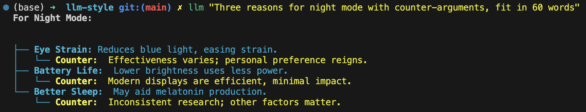

.. _readme_rst_full_v2:

> Colors are perception, child. We decide what they mean.
>
> -- Inspired by themes in Brandon Sanderson's *Warbreaker*

====================================================
 llm-style: Rich Terminal Styling for LLM Output
====================================================

**Version: 0.7.0** *(Reflecting adaptive default and shell updates)*

Rich terminal styling for Markdown-like LLM output using panels, trees, inline styles, dynamic color transformations, and configurable regex rules.

.. figure:: uglify.png
   :alt: Example using the tan-crazybold theme with reverse bold.

   *(Above: Example using the ``tan-crazybold-style.json`` theme. The "crazy" reverse video for bold is intentional for high contrast.)*



   *(Above: Example using the new default 'adaptive' style theme on a dark terminal. While aiming for legibility on both light and dark backgrounds, colors like yellow/cyan may appear bright. Consider a dark-specific theme for better aesthetics if you primarily use a dark terminal.)*


Motivation
----------

Raw text output from LLMs can be hard to read, especially when it contains structural elements like headers, lists, or code blocks but isn't always perfectly valid Markdown. Standard Markdown renderers might fail or produce suboptimal results on this "Markdown-like" text.

``llm-style`` aims to bridge this gap by using a combination of configurable regular expressions and a state machine to detect common structural elements and apply rich formatting (colors, bold, italic, panels, tree guides) using the excellent `rich`_ Python library, making the output significantly more readable directly in the terminal.

.. _rich: https://github.com/Textualize/rich


Key Features
------------

- **Markdown-like Aware:** Designed to handle common structures found in LLM output, even if not strictly valid Markdown.
- **Highly Configurable:** Uses simple JSON files for:
    - ``detection.json``: Define regex patterns to identify structures.
    - ``mapping.json``: Map detected structures to style names or block configurations.
    - ``<style-file>.json`` (e.g., ``styles.json``, ``green-theme.json``): Define named styles using `rich`_'s powerful syntax, including dynamic transformations.
- **Rich Output:** Leverages the `rich`_ library for:
    - Colors (Truecolor, 256, basic).
    - Styles (bold, italic, underline, dim, reverse, etc.).
    - **Panels:** Draws borders around code blocks and blockquotes.
    - **Trees:** Draws guide lines for nested lists.
    - Syntax highlighting for code blocks (requires `pygments`_).
- **Dynamic Inline Styles:** Configure inline styles (like bold) to dynamically adjust color (brightness, saturation, hue) based on the surrounding text's color. (Note: Less effective with the adaptive default theme).
- **Style Themes:** Load different style definitions using the ``--style`` argument. The default is ``styles.json``.
- **Flexible Detection:** Uses regex for primary structure detection, allowing custom rules beyond standard Markdown.
- **Pipeline Friendly:** Designed to be used in standard Unix pipelines (e.g., ``llm ... | llm-style.py``).
- **Shell Integration:** Optional shell function (Zsh example provided) to automatically pipe ``llm`` output.
- **Debug Mode:** Includes a ``--debug`` flag for verbose configuration loading/validation and transformation output.
- **Markup Preservation:** Optional ``--keep-markup`` flag to display original block markup characters (``#``, ``*``, ``>``).

.. _pygments: https://pygments.org/


Installation
------------

1.  **Prerequisites:**

    - Python 3.7+ (Python 3.8+ recommended for built-in ``colorsys``)
    - ``pip`` (Python package installer)

2.  **Required Libraries:**

    - ``rich``: The core rendering library. (Version 13+ recommended).
    - ``pygments`` (Optional, but Recommended): For syntax highlighting within code blocks.
    - ``colorsys`` (Usually built-in with Python): Required for dynamic color transformations. If missing, transforms will be skipped.

    Install them using pip:

    .. code-block:: bash

       pip install "rich>=13.0" pygments

3.  **Get the Script:**

    - Clone this repository or download the ``llm-style.py`` script directly.

      .. code-block:: bash

         # Example if cloning
         git clone https://github.com/gagin/llm-style.git
         cd llm-style

4.  **Make Executable (Optional):**

    .. code-block:: bash

       chmod +x llm-style.py


Usage
-----

``llm-style`` reads text from standard input and prints styled output to standard output. It's designed to be used in a pipeline.

**Basic Usage (Default Style):**

Pipe the output of the `llm command`_ (or any text-producing command) into the script. This uses ``styles.json`` in your config directory (by default ``~/.config/llm-style/``), creating it with the default adaptive theme if it doesn't exist.

.. code-block:: bash

   llm "Explain Python decorators" | python llm-style.py
   # Or if executable:
   # llm "Explain Python decorators" | ./llm-style.py

.. _llm command: https://llm.datasette.io/

**Using a Specific Style Theme:**

Use the ``--style`` argument to specify a different JSON file. The resolution order is: 1. Absolute path. 2. Path relative to current directory. 3. Filename within config directory.

.. code-block:: bash

   # Assuming you have ~/.config/llm-style/tan-crazybold-style.json
   llm "Pros and cons" | python llm-style.py --style tan-crazybold-style.json

**Using a Local Style File (without copying):**

You can use a style file by providing a relative or absolute path. If the path exists, it will be loaded directly. You can also use ``--config-dir .`` to make the script look for ``detection.json`` and ``mapping.json`` in the current directory.

.. code-block:: bash

   # Attempts to load style directly by path (relative or absolute)
   llm "Use path style" | python llm-style.py --style ./path/to/my-style.json

   # Use style from current dir, look for other configs in current dir too
   # Allows detection.json/mapping.json to be created in '.' if missing
   llm "Use local style" | python llm-style.py --config-dir . --style my-local-style.json

**Using Shell Integration (Recommended for Convenience):**

If you've added the provided Zsh function (see :ref:`shell-integration`) to your ``.zshrc``, you can just use the ``llm`` command directly, and it will automatically be styled using your configured preference. You can also override the style per-command using ``--llm-style``.

.. code-block:: bash

   # Assumes the 'llm' function is defined in .zshrc to pipe through the styler
   llm "This output will be automatically styled with the default"

   # Temporarily use a different style for this command only
   llm --llm-style tan-crazybold-style.json "This uses the tan theme"

**Keeping Block Markup:**

.. code-block:: bash

   llm "Show raw markdown" | python llm-style.py --keep-markup

**Debugging Configuration:**

Redirect standard output to ``/dev/null`` and error/debug output to a file to isolate debug messages.

.. code-block:: bash

   llm "Debug this" | python llm-style.py --debug --style my-debug-style.json > /dev/null 2> debug.log

*(Note: Replace ``python llm-style.py`` with ``./llm-style.py`` if executable and in the correct path/directory).*


``--help`` Output
-----------------

.. code-block:: text

   usage: llm-style.py [-h] [--config-dir CONFIG_DIR] [--style STYLE] [--debug] [--keep-markup]

   Apply styles to text input based on configurable rules.

   options:
     -h, --help            show this help message and exit
     --config-dir CONFIG_DIR
                           Directory containing detection.json, mapping.json, and style JSON files. (default: ~/.config/llm-style)
     --style STYLE         Filename or path of the style definitions JSON file. Resolution order: 1. Absolute path. 2. Path relative to current directory. 3. Filename within config directory. (default: styles.json)
     --debug               Enable debug/verbose output to stderr. (default: False)
     --keep-markup         Keep original Markdown block characters (e.g., '#', '*', '>') in the output. (default: False)


Showcase Script (``showcase-brief.sh``)
--------------------------------------

A helper script ``showcase-brief.sh`` is available in the repository to quickly compare multiple ``*style.json`` or ``*styles.json`` files located in the current directory. Edit the script to set the correct path to ``llm-style.py``, make it executable (``chmod +x showcase-brief.sh``), and run it (``./showcase-brief.sh``) in a directory containing your style JSON files. It will first run with the default style, then iterate through local style files found, displaying a short sample for each.


Comparison with Other Tools
---------------------------

Tools like `glow`_, `mdcat`_, and `bat`_ are excellent terminal Markdown renderers/viewers. Why use ``llm-style``?

- **Strictness:** Tools like ``glow`` or ``mdcat`` often expect reasonably valid CommonMark or GitHub Flavored Markdown. They might produce errors or poor formatting if the LLM output deviates significantly (e.g., inconsistent indentation, malformed lists, unusual syntax). ``llm-style`` uses regex and is designed to be more forgiving of "Markdown-like" text.
- **Flexibility vs. Robustness:** Standard Markdown renderers have robust parsers for *Markdown*, handling complex nesting and edge cases correctly, including inline formatting. ``llm-style``'s regex-based approach (especially for inline elements) is less robust for pure Markdown but offers the flexibility to style arbitrary, non-Markdown patterns defined in ``detection.json``.
- **Unique Rendering:** ``llm-style`` leverages `rich`_ features not typically found in standard Markdown viewers, specifically drawing bordered **Panels** around code blocks/blockquotes and rendering nested lists with guiding **Tree** lines.
- **Configuration:** ``llm-style`` offers direct JSON configuration for detection patterns, style mapping, and `rich`_ styles, including dynamic color transformations for inline elements. Other tools rely on their specific theme formats.

**Choose ``llm-style`` if:**

- Your input is often "Markdown-like" but not strictly valid.
- You want the specific visual structure provided by Panels and Trees.
- You need to style custom text patterns beyond standard Markdown using regex.
- You want dynamic inline styling based on context (works best with non-adaptive themes).
- You prefer direct JSON configuration tied to `rich`_ and want theme support.

**Choose standard tools (``glow``, ``bat``, ``mdcat``) if:**

- Your input is reliably well-formed Markdown.
- Robust handling of all Markdown features (especially complex inline/nested elements) is the top priority.
- You prefer using existing theme ecosystems (e.g., for `bat`_).

.. _glow: https://github.com/charmbracelet/glow
.. _mdcat: https://github.com/swsnr/mdcat
.. _bat: https://github.com/sharkdp/bat


Configuration
-------------

On the first run, if the configuration directory (default: ``~/.config/llm-style/``) or the default config files don't exist, ``llm-style`` will create them with the default adaptive settings.

- **``detection.json``:** Maps rule names to Python regex patterns for structure detection.
- **``mapping.json``:** Connects rule names from ``detection.json`` to style names or special block configurations (like panels). Requires ``"default_text"``.
- **``<style-file>.json``** (e.g., ``styles.json``, specified via ``--style``): Maps style names (referenced in ``mapping.json``) to `rich`_ style definitions. This is where colors, attributes, and dynamic transformations are defined.

**Recommendation:** Start with the default adaptive theme. If you primarily use a dark or light terminal and find the adaptive theme lacking, copy the generated ``styles.json`` to a new name (e.g., ``my-dark-theme.json``) and customize it heavily for your specific background. Use theme examples (like ``tan-crazybold-style.json``, ``panel-showcase-style.json``) from the source repository as inspiration. Use the ``--style`` argument (or the Zsh wrapper's ``--llm-style`` override) to select your preferred theme.


.. _terminal-theming-challenge:

A Note on Terminal Backgrounds and the Default Style
~~~~~~~~~~~~~~~~~~~~~~~~~~~~~~~~~~~~~~~~~~~~~~~~~~~~

Styling terminal output effectively can be challenging because users may have vastly different terminal background colors (typically light or dark). A style theme designed for a dark background often looks poor on a light background, and vice-versa, primarily due to contrast issues.

- **Dark Themes:** Usually use light/bright text colors.
- **Light Themes:** Usually use dark text colors.

The *previous* default style for ``llm-style`` was optimized for **dark backgrounds** (using a green color scheme). While visually appealing in that context, it performed poorly on light backgrounds.

The **current default style** has been changed to an **"adaptive" theme**. This theme prioritizes using standard ANSI color names (like ``red``, ``blue``, ``yellow``, ``cyan``) and the ``default`` keyword wherever possible. The goal is **legibility** across both light and dark terminals, relying on the terminal's own theme settings to render those standard colors appropriately for the background.

**The Trade-off:** While this adaptive default aims for broad compatibility, it's a compromise. As seen in the example screenshot at the top, standard bright colors like yellow and cyan can appear quite intense or less aesthetically refined on dark backgrounds compared to a theme specifically tuned for dark mode.

**Recommendation:**

- If you **primarily use one background color** (either light or dark) and don't switch often, you will likely get a much better visual result by **using a style theme specifically designed for that background**.
- You can use the adaptive theme as a starting point, but consider creating your own ``my-dark-theme.json`` or ``my-light-theme.json``.
- For a dark-background theme example, look for the previous default (e.g., ``green-default-example.json`` in the repository) or other examples like ``tan-crazybold-style.json``.
- Use the ``--style`` argument (or the Zsh wrapper's ``--llm-style`` override) to select your preferred theme.


Color Guide (Using `rich`_ Styles)
----------------------------------

The styles defined in your style JSON file use the syntax understood by the `rich`_ library.

**How to Specify Colors:**

1.  **Standard Color Names:** Use common names like ``"red"``, ``"green"``, ``"blue"``, ``"yellow"``. Also includes basic ANSI names like ``"bright_black"``, ``"bright_red"`` etc. Hex codes are generally more reliable than less common names.
2.  **Hex Codes (Truecolor):** Recommended for specific colors if your terminal supports Truecolor. Example: ``"#FFA500"``, ``"#A0522D"``.
3.  **RGB Tuples (Truecolor):** Specify RGB values from 0-255. Example: ``"rgb(255,165,0)"``.
4.  **Numbered Colors (256-Color Terminals):** Use numbers 0-255. Example: ``"color(178)"``.
5.  **`default` Keyword:** Use ``"default"`` to represent the terminal's default foreground or background color. Essential for adaptive themes.

**Combining with Attributes:**

Combine colors with attributes like ``bold``, ``italic``, ``underline``, ``dim``, ``strike``, ``reverse``, and background colors using ``on <color>``.

*Example:* ``"style_error": "bold white on red"``
*Example:* ``"style_inline_bold": "bold reverse"``

Refer to the `rich Style documentation`_ for comprehensive details.

.. _rich Style documentation: https://rich.readthedocs.io/en/latest/style.html


Inline Style Customization & Transformations
--------------------------------------------

Inline styles (``bold``, ``italic``, ``code``) are handled via rules like ``inline_bold_star``, ``inline_code``, etc., in ``detection.json``. These implicitly map to styles named ``style_inline_bold``, ``style_inline_italic``, and ``style_inline_code`` in your active style JSON file.

You can define these styles in two ways:

1.  **Simple String:** Uses standard `rich`_ style syntax. The style is applied directly. If only an attribute (like ``italic``) is given, the color is inherited from the surrounding text.

    .. code-block:: json

       {
         "style_inline_italic": "italic",
         "style_inline_code": "yellow on gray19",
         "style_inline_bold": "bold reverse"
       }

2.  **Object with Transformation:** Allows dynamic color adjustment based on the surrounding text's color. Requires the ``colorsys`` Python module. **Note:** Less effective with adaptive themes relying on ``default`` or variable ANSI colors.

    .. code-block:: json

       {
         "style_inline_bold": {
           "attributes": "bold",
           "transform": {
             "adjust_brightness": 1.25,
             "adjust_saturation": 1.1,
             "shift_hue": 5
           }
         }
       }

    - ``"attributes"``: (String) Basic `rich`_ style attributes (e.g., ``"bold"``, ``"bold underline"``).
    - ``"transform"``: (Object, Optional) Rules for color modification (``adjust_brightness``, ``adjust_saturation``, ``shift_hue``). See source code for details on implementation.

    **How it works:** The script gets the base color. If a ``transform`` object is defined, it attempts HSL adjustments and uses the *new* color with the defined ``attributes``. If transformation fails (e.g., base color unusable), only ``attributes`` are applied.

**Important Note:** Inline styling (including transformations) is **not** applied within fenced code blocks (``` ```). The content of code blocks is treated literally to preserve code structure and syntax, optionally using language-specific syntax highlighting via `pygments`_.


A Note on Color Transformations and ``rich`` / Environment Issues
----------------------------------------------------------------

The dynamic color transformation feature relies on:
1. The ``colorsys`` standard Python library module.
2. The ability to reliably get an RGB representation of the "base color" from the ``rich.color.Color`` object provided by the parsed base style.

During development, peculiar ``AttributeError``\ s related to ``rich.color.ColorType.RGB`` and ``rich.color.ColorType.SYSTEM`` were encountered in certain environments (specifically observed within a Conda setup). The root cause likely relates to environment inconsistencies or how Python modules are loaded/shadowed.

**The Workaround:** The ``_apply_transform`` function in ``llm-style.py`` includes a workaround that avoids directly referencing ``ColorType`` attributes by name. Instead, it checks the integer value of the color type (``int(base_color.type)``) against expected standard values (e.g., ``3`` for ``TRUECOLOR``) or accesses the ``.triplet`` attribute directly.

**Caveats:**
* This workaround relies on internal integer values of ``ColorType`` members remaining consistent.
* Transformations may still fail if ``get_truecolor()`` cannot resolve certain base colors (like ``default``).
* If you encounter persistent issues (check ``--debug`` output), ensure a clean Python environment and reinstall `rich`_ (``pip install --force-reinstall "rich>=13.0"``).


.. _shell-integration:

Shell Integration (Optional)
~~~~~~~~~~~~~~~~~~~~~~~~~~~~

For convenience, you can add a function to your shell's configuration file (e.g., ``.zshrc`` for Zsh, ``.bashrc`` for Bash) to automatically pipe the output of the ``llm`` command through the styler.

**Example for ``.zshrc``:**

This function overrides the default ``llm`` command and includes logic to handle a custom ``--llm-style`` argument for per-command theme overrides.

.. code-block:: zsh

   # ------------------------------------------------------------
   # llm-style integration (Override llm command)
   # ------------------------------------------------------------

   # --- Configure these paths/filenames ---
   _LLM_STYLE_SCRIPT="/path/to/your/llm-style.py" # EDIT THIS: Absolute path to the script
   _LLM_STYLE_DEFAULT_FILE="styles.json"             # EDIT THIS: Filename of your preferred default style
   # ----------------------------------------

   llm() {
     # --- Argument Parsing Logic ---
     local style_override=""
     local original_llm_args=() # Array to hold args for the *original* llm command

     while [[ $# -gt 0 ]]; do
       case "$1" in
         --llm-style)
           if [[ -z "$2" || "$2" == -* ]]; then # Check if value is missing or looks like another flag
             echo "Zsh Error: --llm-style requires a non-flag value." >&2
             return 1
           fi
           style_override="$2"
           shift 2 # Consume --llm-style and its value
           ;;
         *)
           # Not --llm-style, add it to the list for the original command
           original_llm_args+=("$1")
           shift 1 # Consume this argument
           ;;
       esac
     done
     # --- End Argument Parsing Logic ---

     # --- Determine final style file ---
     local final_style_file=$_LLM_STYLE_DEFAULT_FILE
     if [[ -n "$style_override" ]]; then
       final_style_file="$style_override"
     fi
     # --- End Determine final style file ---

     # Use 'command llm' to call the *original* llm executable, preventing recursion
     if ! command -v llm &> /dev/null; then
       echo "Zsh Error: Original 'llm' command not found." >&2
       return 1
     fi

     # Check if style script exists and is runnable
     if [[ ! -f "$_LLM_STYLE_SCRIPT" || (! -r "$_LLM_STYLE_SCRIPT" && ! -x "$_LLM_STYLE_SCRIPT") ]]; then
        echo "Zsh Warning: llm-style script not found/runnable at '$_LLM_STYLE_SCRIPT'. Running 'llm' without styling." >&2
        # Pass the filtered arguments to the original command
        command llm "${original_llm_args[@]}"; return $?
     fi

     # Construct and run the final command with potentially filtered args and overridden style
     command llm "${original_llm_args[@]}" | python "$_LLM_STYLE_SCRIPT" --style "$final_style_file"

     # Preserve the exit status of the pipe (Zsh specific: index 2 is the python script)
     # For Bash, use: return ${PIPESTATUS[1]}
     return ${pipestatus[2]}
   }
   # ------------------------------------------------------------
   # End llm-style integration
   # ------------------------------------------------------------

**Setup:**
1. **Edit** the function, setting ``_LLM_STYLE_SCRIPT_PATH`` and ``_LLM_STYLE_DEFAULT_FILE``.
2. **Add** the block to your ``~/.zshrc`` file.
3. **Reload** your shell configuration (``source ~/.zshrc`` or open a new terminal).

**Using the ``--llm-style`` Override:**

The updated wrapper function introduces a special argument, ``--llm-style <filename>``. When you use this *before* your prompt or other ``llm`` options:

- The wrapper function detects ``--llm-style``.
- It takes the next argument (e.g., ``my-theme.json``) as the desired style file for this specific command.
- It **removes** both ``--llm-style`` and ``my-theme.json`` from the arguments passed to the underlying ``llm`` executable.
- It passes the specified ``my-theme.json`` to the ``llm-style.py`` script via its ``--style`` argument, overriding the default specified in ``_LLM_STYLE_DEFAULT_FILE``.

Example:
.. code-block:: zsh

   # Uses the default style defined in the zsh function
   llm "Explain adaptiveness"

   # Overrides the default, using "dark-theme.json" for this command only
   llm --llm-style dark-theme.json "Explain adaptiveness"

   # Also works with other llm options (put --llm-style before the prompt)
   llm -m gpt-4-turbo --llm-style light-theme.json "Explain adaptiveness"


**Bypassing the Wrapper:**
To run the original ``llm`` command without styling, use:
``command llm "your prompt"`` or ``\llm "your prompt"``


Limitations
-----------

- **Inline Parsing:** Basic regex parsing may fail on complex nested Markdown (e.g., bold inside italic within a link).
- **Inline Styles in Code Blocks:** Inline Markdown formatting (like bold, italic, or transformations) is **not** applied within fenced code blocks (``` ```) as their content is treated literally.
- **Regex Dependency:** Output quality depends heavily on ``detection.json`` patterns.
- **Block State Machine:** Simple logic may break on complex, interleaved, or malformed block structures (code, quotes, lists).
- **Color Transformation Robustness:** See note above regarding environment issues and base color conversion limitations, especially with adaptive themes.
- **Performance:** Very large inputs might experience slower processing.


Future Development
------------------

- **Testing:** Implement a robust test suite, focusing on edge cases, transformations, and parsing robustness.
- **``llm`` Plugin:** Develop an official plugin for Simon Willison's `llm command`_.
- **Enhanced Inline Parsing:** Investigate more robust methods for handling inline markup.
- **Configuration Options:** Configurable list indent width, guide chars, more Panel options.
- **More Structure Detection:** Add rules for tables, definition lists if feasible.
- **Performance Profiling:** Analyze and optimize for large inputs.
- **Documentation:** Improve config/transform docs and troubleshooting guides.


Credits
-------

This script was implemented by Google Gemini 2.5 Pro (Experimental Model 03-25), ideated, curated and iterated by the author, Alex Gaggin.


License
-------

MIT License

Copyright (c) 2025 Alex Gaggin

Permission is hereby granted, free of charge, to any person obtaining a copy of this software and associated documentation files (the "Software"), to deal in the Software without restriction, including without limitation the rights to use, copy, modify, merge, publish, distribute, sublicense, and/or sell copies of the Software, and to permit persons to whom the Software is furnished to do so, subject to the following conditions:

The above copyright notice and this permission notice shall be included in all copies or substantial portions of the Software.

THE SOFTWARE IS PROVIDED "AS IS", WITHOUT WARRANTY OF ANY KIND, EXPRESS OR IMPLIED, INCLUDING BUT NOT LIMITED TO THE WARRANTIES OF MERCHANTABILITY, FITNESS FOR A PARTICULAR PURPOSE AND NONINFRINGEMENT. IN NO EVENT SHALL THE AUTHORS OR COPYRIGHT HOLDERS BE LIABLE FOR ANY CLAIM, DAMAGES OR OTHER LIABILITY, WHETHER IN AN ACTION OF CONTRACT, TORT OR OTHERWISE, ARISING FROM, OUT OF OR IN CONNECTION WITH THE SOFTWARE OR THE USE OR OTHER DEALINGS IN THE SOFTWARE.